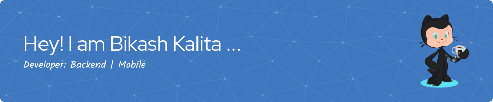

<!--
Link for the badges: https://dev.to/envoy_/150-badges-for-github-pnk
Github status: https://dev.to/envoy_/150-badges-for-github-pnk#github-stats
Project status : https://dev.to/envoy_/150-badges-for-github-pnk#maintained
Website Status : https://dev.to/envoy_/150-badges-for-github-pnk#website-stats
Header Image Generator : https://leviarista.github.io/github-profile-header-generator/
-->

### Hi there 👋
<picture>
 <source media="(prefers-color-scheme: dark)" srcset="github-header-image.png">
 <source media="(prefers-color-scheme: light)" srcset="github-header-image.png">
 
</picture>

## About me
I am a Backend and Mobile Developer with a passion for creating high-performance applications. 
I am committed to delivering high-quality code and strive to continuously learn and improve my skills. You can find some of my projects on my GitHub page.

Thank you for taking the time to visit my page. I am always open to new opportunities, so please don't hesitate to contact me if you have any questions or if you would like to collaborate.

## My Tech Stack

<table>
 <tr>
  <td>👩‍💻 Languages </td>
  <td>
   
   
   
   
   
   
    
  </td>
 </tr>
<!--  <tr>
  <td>🚀 Frontend Frameworks </td>
  <td> 
   
   
  </td>
 </tr> -->
 <tr>
  <td>🚀 Backend Frameworks </td>
  <td> 
   
   
   
  </td>
 </tr>
 <tr>
  <td>🚀 Mobile Frameworks </td>
  <td> 
   
  </td>
 </tr>
 <tr>
  <td>⚡ Databases</td>
  <td> 
   
   
   
<!--     -->
<!--     -->
  </td>
 </tr>
 <tr>
  <td>📑 Version control </td>
  <td>
   
   
  </td>
 </tr>
 <tr>
  <td>👨‍🔬 Testing </td>
  <td> 
   
  </td>
 </tr>
<!--  <tr>
  <td>👨‍🔬 Workflow Platforms </td>
  <td> 
   
  </td>
 </tr> -->
 <tr>
   <td>👨‍🔬 IoT </td>
   <td> 
   <!-- Sub categorize the following into "Prototyping tools"  -->
   
   
  </td>
 </tr>
 <tr>
  <td>👨‍🔬 ORM </td>
  <td> 
  
  </td>
 </tr>
 <tr>
  <td>📦 Package Manager </td>
  <td> 
   
   
  </td>
 </tr>
<!--  <tr>
  <td>🖥️ Message Broker Platform </td>
  <td> 
   
  </td>
 </tr> -->
 <tr>
  <td>🖥️ Linters </td>
  <td> 
    
    
  </td>
 </tr>
 <tr>
  <td>🖥️ OS </td>
  <td> 
   
   
   
  </td>
 </tr> 
 <tr>
  <td>🖥️ IDE / Code Editors </td>
  <td> 
   
   
   
  </td>
 </tr>
</table>
 

 <h2>👋 Connect with me on </h2>
 	
  

<!-- 
Collapsed Contents
To make the section open by default use : 

My top THINGS-TO-RANK

YOUR TABLE

 -->

<!-- 
Example code snippet for using quotes:
---
> If we pull together and commit ourselves, then we can push through anything.

— Mona the Octocat -->

<!--
**bikash-kalita-code/bikash-kalita-code** is a ✨ _special_ ✨ repository because its `README.md` (this file) appears on your GitHub profile.

Here are some ideas to get you started:

- 🔭 I’m currently working on ...
- 🌱 I’m currently learning ...
- 👯 I’m looking to collaborate on ...
- 🤔 I’m looking for help with ...
- 💬 Ask me about ...
- 📫 How to reach me: ...
- 😄 Pronouns: ...
- ⚡ Fun fact: ...
-->
